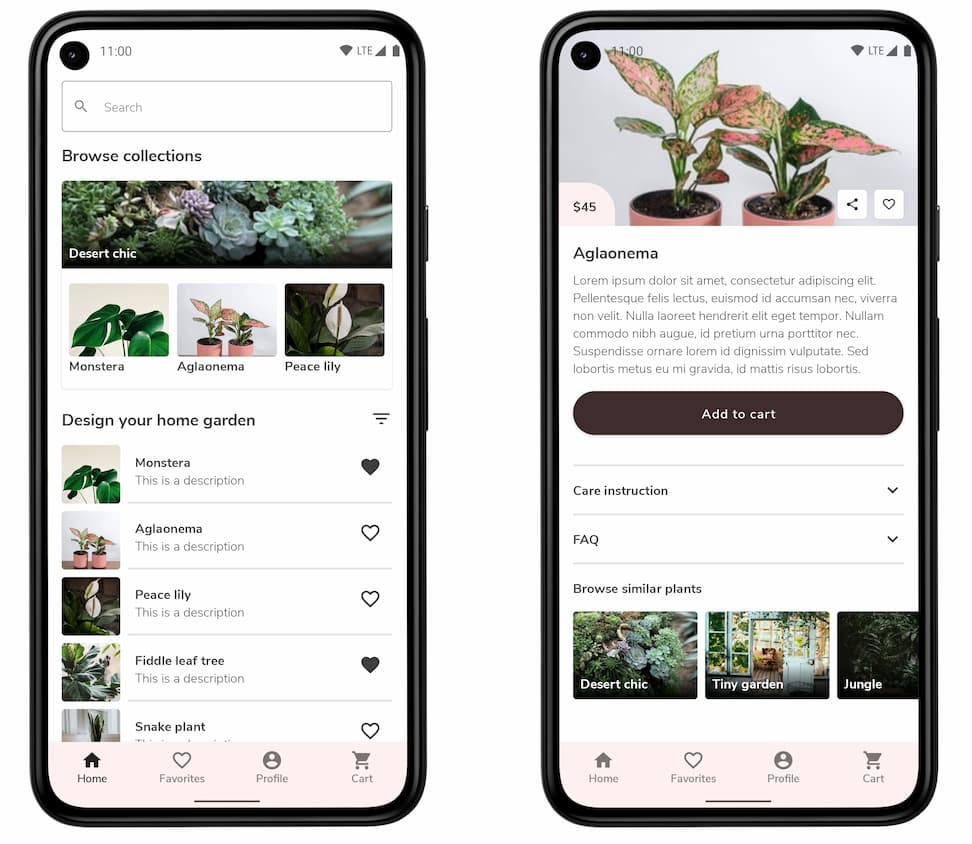

# Android Compose Playground

Small project to try [Jetpack Compose](https://developer.android.com/jetpack/compose).

This project tries to copy the design and structure of a fictional app shown in the video ["Using Jetpack libraries in Compose"](https://www.youtube.com/watch?v=0z_dwBGQQWQ) from Google I/O 2021.

This design was also featured in the [Android Dev Challenge (Week 3)](https://github.com/android/android-dev-challenge-compose) and we can find [design mocks](https://github.com/android/android-dev-challenge-compose/blob/assets/Bloom.zip) to help us with some details.

## What does this project use

- [x] **Compose**
- [x] Room
- [x] Paging
- [x] Navigation + ViewModel
- [x] Hilt

## What's next

- [ ] Tests
- [ ] Accessibility

## Screenshots

---

Plant images from [Unsplash](https://unsplash.com/ "Unsplash") - [(License)](https://unsplash.com/license "License")